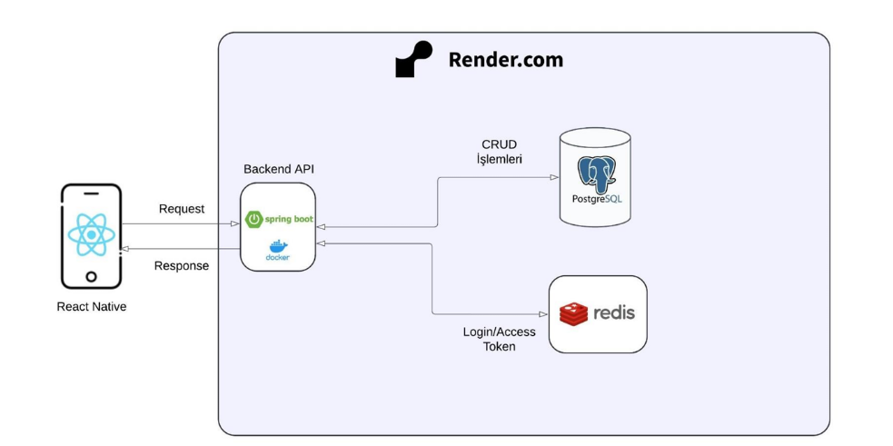
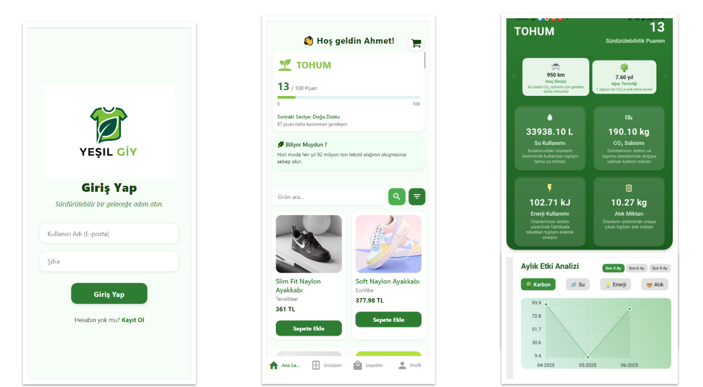
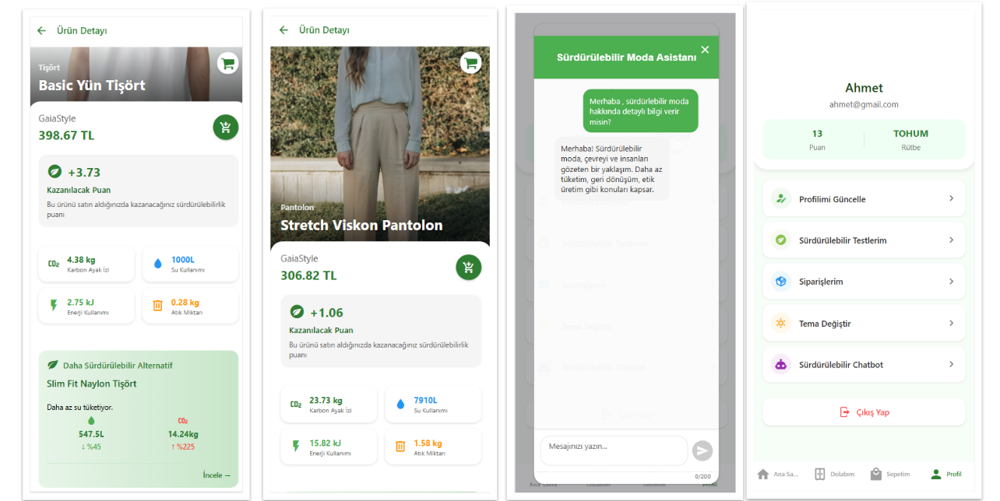
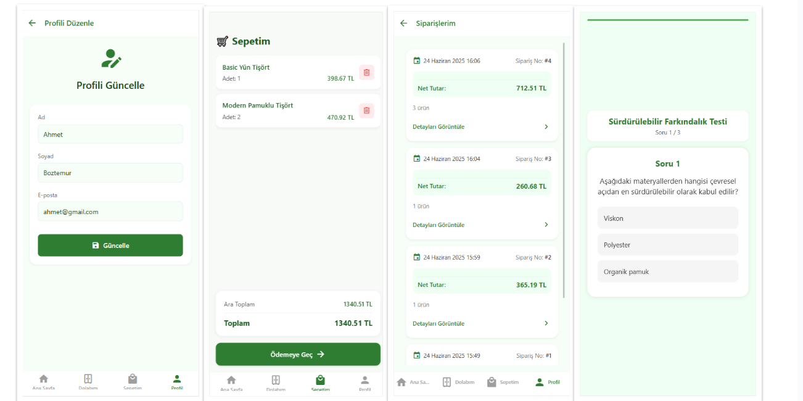

# 🌱 Sustainable Wardrobe - Sustainable Fashion Tracking Application

In today's world, the fashion industry doesn't just produce style and aesthetics; it also creates significant environmental and social impacts. This mobile application is a digital solution that allows users to track the environmental impacts of their clothing purchases, make sustainable choices, and develop environmentally conscious shopping habits.

---

## 📱 Application Features

### 🏠 Home Page
- User's **sustainability score** and **rank**
- Information cards (tips, sustainability suggestions)
- Filterable product list

### 👚 My Wardrobe
- **Total environmental impacts** of purchased products:
  - Water Consumption (L)
  - Carbon Footprint (kg CO₂)
  - Energy Usage (kWh)
  - Waste Amount (g)
- **Time-based environmental analysis** with graphs

### 🔍 Product Detail Page
- Product image, price, environmental impact data
- **More sustainable alternative product recommendations**
- Informative comparisons:
  - Water = number of showers
  - Carbon = kilometers of car usage
  - Energy = days of household electricity
  - Waste = average household waste amount

### 🎯 Quiz and Chatbot
- Test your knowledge with short quizzes
- **Gemini AI** integration for intelligent chatbot
- Eco-friendly shopping guide and sustainability advice

### 🧾 Profile and Settings
- Theme selection (Light/Dark Mode)
- Order history and cart management
- Profile information editing
- Badge system and point rewards

---

## 🏗️ System Architecture



This architecture is deployed on the **Render.com** platform. The Spring Boot application is packaged with Docker and deployed, while PostgreSQL and Redis services are also hosted in the same environment. This structure ensures that application components work in an integrated and scalable manner in the cloud environment.

---

## 🧠 Technologies Used

### Backend
- **Spring Boot** - Java-based web framework
- **PostgreSQL** - Relational database
- **Redis** - Caching and session management

### Mobile Application
- **React Native** - Cross-platform mobile application development

### AI and Calculations
- **Google Gemini API** - AI chatbot integration
- **Python** - LCA (Life Cycle Assessment) calculations

### Deployment
- **Docker** - Containerization
- **Render.com** - Cloud deployment platform

---

## 🔢 Environmental Impact Calculation

Environmental impacts of products are calculated using Python based on **Life Cycle Assessment (LCA)** data according to product materials and weight. Four fundamental metrics are calculated by applying customized coefficients for each category:

- Water consumption (L)
- Carbon footprint (kg CO₂)
- Energy consumption (kWh)
- Waste production (g)

---

## 🖼️ Screenshots







---

## 🚀 Installation and Setup

### For Backend:

```bash
cd finalYearProject/product
./mvnw spring-boot:run
```

### For Mobile Application:

```bash
cd bitirmeApp
npm install
npx expo start
```

---

## 📊 Results

The developed application has enabled users to see environmental impacts with more concrete data and has encouraged conscious consumption behaviors. The direct display of impacts such as water consumption, carbon footprint, energy requirement, and waste amount of products has created awareness in shopping decisions. Additionally, interactive content such as quizzes and chatbots has increased users' knowledge about sustainable fashion and strengthened their commitment to the system.